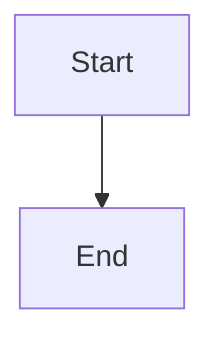
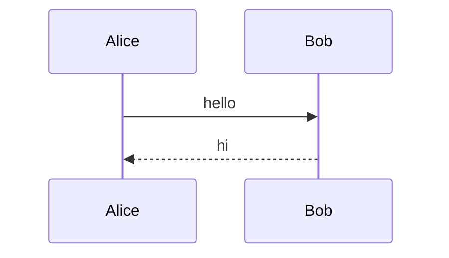

# Mermaid export fixture (plan 11 task 11.5)

Three mermaid diagrams: two valid and one with a syntax error. The PNG
export pipeline renders every diagram first and must refuse the whole
export, naming the failing diagram, when one of them fails.



Middle paragraph.



The broken diagram below must refuse the export.

```mermaid
graph TD
  A[Start] --> B[End BROKEN
```

Trailing paragraph.
